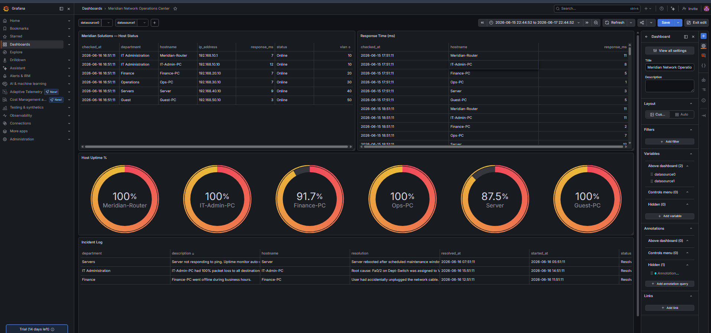

# Network Operations & Monitoring Lab

**Cisco Packet Tracer · Python · SQL Server · Streamlit · Grafana**

I built this project to fill the biggest gap on my resume: I was applying for Network Admin and DBA roles but had no hands-on infrastructure work to show. This lab is my answer to that. It's not a class assignment — I designed it myself to demonstrate the exact skills those job postings ask for.

[](https://tealjeep3109.grafana.net/public-dashboards/2fe1661bb8c7468d90b36d95464d0591)
[](https://python.org)
[](https://microsoft.com/sql-server)

---

## Live Dashboard
**[→ Meridian Network Operations Center on Grafana](https://tealjeep3109.grafana.net/public-dashboards/2fe1661bb8c7468d90b36d95464d0591)**

---

## What I Built

The fictional company is **Meridian Solutions** — 25 employees across Finance, Operations, and IT Administration. I treated it like a real environment: designed the network, secured it, built monitoring tools around it, stored the operational data in a database, and documented everything the way a junior admin would on the job.

**The four parts:**
1. Designed and configured a segmented network in Cisco Packet Tracer (VLANs, inter-VLAN routing, ACLs)
2. Wrote a Python script that pings every host every 60 seconds and logs results to SQL Server
3. Set up SQL Server with a normalized schema, user roles, backup jobs, and a restore runbook
4. Built a live Grafana dashboard that anyone can view showing host status, uptime %, and incidents

---

## Screenshots

### Network Topology


### ACL Security Test — Guest VLAN Blocked from Server


### Live Grafana NOC Dashboard


---

## Part 1 — Network Design (Cisco Packet Tracer)

Cisco Packet Tracer is the industry-standard simulation tool used in CCNA training. I used it to build a topology I'd realistically see in a small office environment.

**Devices:** 1 Cisco ISR 4331 router, 2 Cisco 2960-24TT switches, 5 PCs

**VLAN segmentation:**

| VLAN | Name | Subnet | Purpose |
|------|------|--------|---------|
| 10 | IT-Admin | 192.168.10.0/24 | IT staff |
| 20 | Finance | 192.168.20.0/24 | Finance dept |
| 30 | Operations | 192.168.30.0/24 | Ops dept |
| 40 | Servers | 192.168.40.0/24 | Internal servers |
| 50 | Guest | 192.168.50.0/24 | Guest WiFi |

**Inter-VLAN routing** is done via router-on-a-stick — one physical cable carries all VLANs as tagged traffic to the router, which routes between them using sub-interfaces.

**Security rule:** ACL `BLOCK-GUEST` blocks the Guest VLAN from reaching the Server VLAN. I tested and verified this — Guest-PC cannot ping the Server, but can still reach Finance and Operations.

**Real troubleshooting I did:** During setup, IT-Admin-PC had 100% packet loss. I diagnosed it with `show vlan brief` and found Fa0/2 was assigned to VLAN 40 instead of VLAN 10. Fixed the port assignment and verified with pings. This is documented in the troubleshooting log.

---

## Part 2 — Python Network Monitor

`monitor.py` connects to the SQL Server database and pings every active host on a 60-second loop. When a host stops responding, it automatically opens an incident record. When it comes back online, it resolves the incident.

```python
# Core loop — runs every 60 seconds
for host in hosts:
    is_online, response_ms = ping_host(ip)
    log_result(conn, host_id, is_online, response_ms)
    if not is_online:
        open_incident(conn, host_id, hostname)
    else:
        resolve_incident(conn, host_id, hostname)
```

---

## Part 3 — SQL Server Database

I used **SQL Server Developer Edition** (free) and **SSMS** — the same tools used in enterprise environments.

**Schema:**
- `hosts` — every monitored device
- `uptime_log` — one row per ping check per host
- `incidents` — outage records with timestamps and resolution notes
- `v_host_uptime` — view calculating uptime % per host
- `v_current_status` — view showing each host's most recent status
- `v_open_incidents` — view for unresolved incidents

**DBA tasks I completed:**
- Created two SQL Server logins with least-privilege permissions (NetworkMonitor can write ping data; ReadOnlyUser can only read views)
- Ran a full backup and a differential backup
- Restored the full backup to a test database (`MeridianOps_Test`) and verified row counts matched
- Documented the recovery procedure in a runbook

All SQL files are in the `/SQL` folder.

---

## Part 4 — Grafana Dashboard

I chose Grafana because it's what real network and DevOps teams use for operational monitoring — not a BI tool. The dashboard reads from `dashboard_data.json` hosted on GitHub using the Grafana Infinity plugin.

**Panels:**
- Host status table with department, IP, response time, and online/offline state
- Uptime % gauge per host with color thresholds (green ≥95%, yellow 80–95%, red <80%)
- Incident log with descriptions and resolutions

---

## Skills This Project Covers

| Skill | Where |
|---|---|
| VLAN configuration | Packet Tracer |
| Inter-VLAN routing (router-on-a-stick) | Packet Tracer |
| Access Control Lists | Packet Tracer |
| Network troubleshooting | Troubleshooting log |
| Python scripting | monitor.py |
| SQL Server schema design | schema.sql |
| Database backup and restore | backup_restore_runbook.sql |
| Role-based access control | security_roles.sql |
| Grafana dashboard configuration | Live dashboard |
| Technical documentation | /docs folder |

---

## Local Setup

```bash
git clone https://github.com/SwayamC1/Network-Ops-Lab.git
cd Network-Ops-Lab
python -m venv venv
venv\Scripts\activate
pip install -r requirements.txt
```

Create a `.env` file:

Set up the database in SSMS by running `SQL/schema.sql` then `SQL/security_roles.sql`. Then:

```bash
python monitor.py       # start the network monitor
streamlit run dashboard.py  # run the local Streamlit dashboard
```

---

## Documentation
- [IP Addressing Plan](docs/ip_addressing_plan.md)
- [Troubleshooting Log](docs/troubleshooting_log.md)
- [Backup & Restore Runbook](SQL/backup_restore_runbook.sql)

---

*Swayam Chopra · UMBC Information Systems '26 · [LinkedIn](https://linkedin.com/in/swayam-chopra100)*
